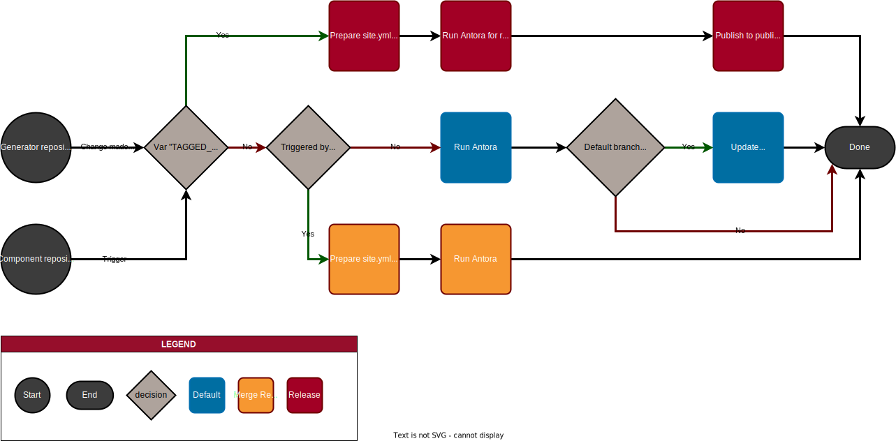

= antora-base-repo-example

> An example repository containing the base Antora generator with a default configuration.
This can be used to generate an Antora site from one or more sources (e.g. standard repositories).
Replace the title and this description with one for your project.

== First time setup

IMPORTANT: This is the Antora generator template.
It requires at least one content repository using the https://code.asam.net/common/templates/standard-template[ASAM Standard Repository Template^].
Make sure to start with that before you follow the instructions below.

To get started with a new project, do the following steps:

* [ ] Rename the title of this README
* [ ] Replace the introductory sentences with something related to your project
* [ ] Rename the file ".gitlab-ci.yml.txt" to ".gitlab-ci.yml"
* [ ] If the project consists of multiple independently versioned repositories, copy the respective lines and repeat this step for each repository
* [ ] Replace the placeholder "ASAM PLACEHOLDER" with the project name and "ASAM_PLACEHOLDER" with the project name with underscores (using "_" instead of " ")
* [ ] Update site.yml
** Check `start_path` to point to correct landing page (typcially: "ASAM_PLACEHOLDER:ROOT:index.adoc")
** Set source (pass:v[https://code.asam.net/[group\]/[subgroup\]/[repository\].git])
**  If the project consists of multiple independently versioned repositories, repeat this last step for each repository
** NOTE: If your project uses another module than the default "ROOT" module for its landing page, make sure to check the official https://docs.antora.org/antora/latest/playbook/site-start-page/[Antora documentation^]
* [ ] Make sure the relative path for "asam-antora-extensions" in the file link:.gitmodules[.gitmodules] leads from this generator repository to the absolute url https://code.asam.net/common/asam-antora-exensions.git (may require more or less relative steps back, i.e. `../`)
* [ ] Remove this section ("First time setup") from the README

== Latest main build
> Add the link to where the compiled documents can be found.
Typically, this would be the hosted Gitlab Pages in this repository.
The pages link can be found under Deploy>Pages.

== Concept
This repository contains the Antora pipeline configuration and general setup for generating an Antora site from one or more content sources.
It aggregates components from other repositories (specified in the site.yml) and generates html content from it.
It also includes the ASAM Antora extensions as a submodule, which can be configured in the site.yml, as well.

== Build content
=== Pipeline

The build pipeline in GitLab is configured so that it can be triggered manually from this repository or automatically from any input repository.
The repositories used as sources can be found in the link:site.yml[site.yml] file.

The pipeline has the three variations:

. If triggered with the variable `TAGGED_RELEASE` (any value), it runs as a release pipeline. +
In this case, it adapts the site.yml to not contain the main branch directly (only include certain tags and branches).
It also runs with the necessary settings to set up the Algolia search for the release version.
Finally, the result from the Antora pipeline is pushed to the publication repository, which hosts all Antora standards generated through GitLab.
. If triggered from a Merge Request from any of the content repositories, the it adapts the site.yml to add the source branch of the merge request to that repository. +
However, note that a run from a Merge Request is never added to the GitLab pages.
. If triggered by a commit on this repository or a commit on the default branch of a content repository, it runs Antora and then publishes the results to the GitLab Pages.

=== Triggers
The pipeline is triggered under the following circumstances:

* The content of this repository is changed
* A pipeline upstream sends a trigger

Each upstream pipeline may send a trigger under different circumstances.
With this, each repository (project) can decide by themselves on when an update is relevant and for which branches/tags/triggers.

NOTE: The pipeline is set up such that each content repository is always collected, independent of where the change occurred.
Likewise, each content repository must be specified in the generator repository's site.yml before its content will be collected.
It is possible to trigger the pipeline from another repository that is not included in the site.yml, but then that repositories content will not be considered in the site generation.

The following variables impact the behavior of this pipeline:

`TAGGED_RELEASE`::
When set to any value, the release pipeline is triggered.

`UPSTREAM_BRANCH` + `UPSTREAM_REPO`::
When set, the pipeline will add the given branch name (`UPSTREAM_BRANCH`) to this of branches for the given repository (`UPSTREAM_REPO`) in the site.yml.
In this case, the result is not published to pages. +
Note that a release takes precedence over a MR pipeline.

== Change output site name
The name of the site generated through Antora is defined in the link:site.yml[site.yml].
To change the name, edit the following section:

[source,yaml]
----
include::site.yml[tag=site]
----
<1> Add the url of the hosted page when using the generator to host the page afterwards.

== Add components (repositories)
This repo retrieves content from two separate repositories:

[source,yaml]
----
include::site.yml[tag=content]
----
<1> standard-template: The content repository based on the standard-template (change this link for your project's content repository)
<2> asam-terminology: The standard repository for ASAM terminology. DO NOT CHANGE THIS LINK!

TIP: The attribute `edit_url` allows you to add an edit button to each page that takes you to the associated .adoc file of that page. Be aware that this attribute is removed automatically by the GitLab pipeline for all releases.

To add a new component (i.e. a new repository) to the project, add its url and configuration to the link:site.yml[site.yml] similarly to <1>.
You must edit the section "sources" therein to do so.

NOTE: For Antora, components are independent of repositories.
A component may be spread over more than one repository.
A repository may also contain more than one component. +
The general recommendation from ASAM is to use one component per repository and vice versa, if possible.

== Set general attributes
You can set general attributes that are then used in every Antora component (i.e. included repository, branch and version).

To add or change such an attribute, edit the following section in the link:site.yml[site.yml]:

[source,yaml]
----
include::site.yml[tag=attributes]
----

NOTE: Some attribute names in Antora are reserved or have specific functions.
See the https://docs.antora.org/antora/latest/playbook/asciidoc-attributes/[Antora documentation^] for more information. +
Other attributes have been specified by ASAM.
Check https://common.pages.asam.net/antora-ui/ASAM_UI/index.html and https://common.pages.asam.net/antora-ui/ASAM_Antora_Extensions/index.html for more on these.

== Build locally
This section describes how to create a local setup for you to build the Antora output on your PC.
For more information on this, check out the https://asam-ev.github.io/asam-project-guide/asamprojectguide/latest/compendium/Tools/docker/02_docker_guides.html#_build_with_the_antora_image[Project Guide on building Antora^].

[TIP]
====
If your build fails because of a missing library or dependency, check the following:

. Did you correctly update to symlinks after your first checkout of the content repositories?
. Did you check out the asam-antora-extensions correctly as a submodule?
. Is your docker image up-to-date?
If not, try pulling in Docker for a newer image.

====

=== Repo structure
IMPORTANT:
For local setup, the content repository/repositories must be located in a folder within the generator.
Make sure to add this folder to the .gitignore of the generator (not the one of the content repositories!) to prevent accidental pushes of this folder to he generator (which leads to technical problems).

To build locally, check out the content and the generator repository as follows:

----
<local folder>
└───antora-base-repo-example/.............# This repository!
    ├───asam-antora-extensions/...........# Submodule (init and update after first checkout)
    ├───<content_repositories>/...........# A folder where the content repository (or repositories) are located
        └───<asam-content-repository>/........# Check out your content repository (or repositories) into their respective folders and add them to the .gitignore of this one!
    ├───repo_images/
    ├───scripts/..........................# Contains a build script for convenience
    └───public/...........................# Will be created with the first local build automatically
----

=== site.yml preparation for local building
The site.yml is designed to retrieve its content from remote.

IMPORTANT: Unless you set up the custom site_local.yml, the local build option will not work as expected!

If you want to build locally without having to push changes first (or you want to try some changes in the site.yml without the risk of accidentally committing them), copy the site.yml and rename the copy to "site_local.yml" (it is then ignored by git).
In this copy, replace the url of all content repositories with a local url (e.g. `url: ./content_repositories/my-first-repo`).
Note: The local url must lead to a folder with a git repository (.git).

=== Build script
To run the build script, make sure you have python3 and docker installed on your computer.
For full functionality, Google Chrome is required as well.

To run the script, enter the scripts folder and run the following command in your terminal:
`python .\build.py`.
This will both build the site and open it in Chrome directly (if possible).
Note that it will always open the latest successful local build even if the current one failed.

You can add one or more of the following options:

`-s`:: Only build.
Does not open the result afterwards automatically.
`-f`:: Only open last build.
`-r`:: If `-f` is not used, will use the remote build configuration (site.yml) instead of the local one (site_local.yml).
